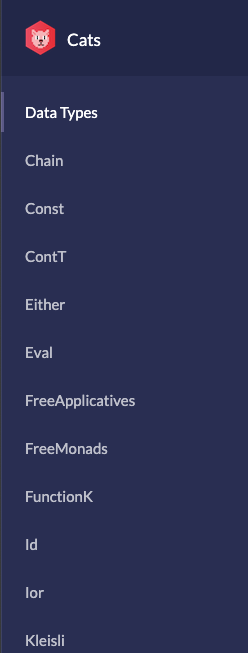

class: title

# 
## Solving the Scala Notebook Experience

### Jeremy Smith .social[.icons[] jeremyrsmith<br />.icons[] gentleman-and-a-scala]
### Jonathan Indig .social[.icons[] jonathanindig<br />.icons[] indigjonathan]

#### Functional Scala 2019

---

# .red[What] is Polynote?

--

Polynote is a **.red[poly]**glot **.red[note]**book environment, built from scratch.

--

Notebooks are documents containing code and the result of executing the code.

--

Notable examples: Jupyter, Zeppelin, Mathematica

---

# .red[Why] did we build it?

--

Scientists were avoiding Scala notebooks for experimentation.

--

It was just a **.red[pain]** to use Scala and Spark in a notebook.

---

# Scala + Spark .red[pain points]

* Interactive autocomplete is practically a *necessity*
* Difficult to find compiler errors
* Dependencies are many and varied
* Spark clashes with dependencies – constantly building shaded JARs

---

class: small-text

# Timeline

* Jan 2017: Original idea – IntelliJ plugin (a few attempts)

--

* Aug 2018: Started a PoC as a side project

--
* Oct 2018: Started sharing PoC with a few researchers

--

* Jan 2019: Netflix decides to invest resources! (Jonathan)

--

* Oct 2019: Announce open-source! 🎉

--

Some learnings from the process...

---

class: small-text

# Why not IDE-based?

A notebook has to display a variety of rich, document-like content.

--

The only standardized, pre-baked mechanism for this is HTML. You can either support HTML, or restrict richness.

--

So you can either embed HTML in your UI, or embed your UI in HTML.

--

(It turned out to be easier for us to do the latter.)

--

 Note: JetBrains now has their own IntelliJ-based product for notebooks – check it out!

---

# Why not a Jupyter kernel?

Jupyter is heavily used and invested in at Netflix. So why not work on a Scala Jupyter kernel?

--

Almond (formerly jupyter-scala) has come a long way and is quite stable and awesome (Check it out!)

--

But, the kernel turned out to be only part of the problem **.red[for our use case]**.

---

class: small-text

# Why not a Jupyter kernel?

Many of the features we wanted could likely be implemented with Jupyter extensions...

--

But Jupyter's model isn't equipped to *efficiently* support them, because the document state is all client-side.

--

For example, autocomplete requires sending the entire cell content to the server (wouldn't want to do that on every keystroke!)

---

class: center middle

# What's .red[different] about Polynote?

---

class: small-text

# Features

* .red[Editing improvements]
* Reproducibility
* Visibility
* Polyglot
* Dependency and Configuration Management
* Data Visualization

---

class: small-text

# Editing improvements
Quality-of-life IDE features like .red[autocomplete] and .red[parameter hints], .red[error highlighting], etc.

---
<video controls>
    <source src="videos/editing_demo.mov">
</video>
<div class="video-controls">
    <button type="button" onclick="playCloneVideo()">▶️</button>
    <button type="button" onclick="pauseCloneVideo()">⏸️</button>
</div>

---

class: small-text

# Features

* Editing improvements
* .red[Reproducibility]
* Visibility
* Polyglot
* Dependency and Configuration Management
* Data Visualization

---

class: small-text

# Reproducibility

Polynote helps keep your notebook state from getting .red[out of control].

It's not a REPL, so there's no hidden state you need to keep track of.

---
<video controls>
    <source src="videos/repro_demo_cut.mov">
</video>
<div class="video-controls">
    <button type="button" onclick="playCloneVideo()">▶️</button>
    <button type="button" onclick="pauseCloneVideo()">⏸️</button>
</div>

---

class: small-text

# Features

* Editing improvements
* Reproducibility
* .red[Visibility]
* Polyglot
* Dependency and Configuration Management
* Data Visualization

---

class: small-text

# Visibility
See what the Kernel's up to with the .red[symbol table], .red[task list] and .red[executing expression highlight].

---
<video controls>
    <source src="videos/visibility_demo_cut.mov">
</video>
<div class="video-controls">
    <button type="button" onclick="playCloneVideo()">▶️</button>
    <button type="button" onclick="pauseCloneVideo()">⏸️</button>
</div>

---

class: small-text

# Features

* Editing improvements
* Reproducibility
* Visibility
* .red[Polyglot]
* Dependency and Configuration Management
* Data Visualization

---

class: small-text

# Polyglot
Each cell in the notebook can be written in a .red[different language], with variables .red[shared between them].

---
<video controls>
    <source src="videos/advanced_polyglot_demo_cut.mov">
</video>
<div class="video-controls">
    <button type="button" onclick="playCloneVideo()">▶️</button>
    <button type="button" onclick="pauseCloneVideo()">⏸️</button>
</div>

---

class: small-text

# Features

* Editing improvements
* Reproducibility
* Visibility
* Polyglot
* .red[Dependency and Configuration Management]
* Data Visualization

---

class: small-text

# Dependency and Configuration Management
Both dependency info and configuration are .red[saved within the notebook itself].

---
<video controls>
    <source src="videos/conf_deps_demo_cut.mov">
</video>
<div class="video-controls">
    <button type="button" onclick="playCloneVideo()">▶️</button>
    <button type="button" onclick="pauseCloneVideo()">⏸️</button>
</div>

---

class: small-text

# Features

* Editing improvements
* Reproducibility
* Visibility
* Polyglot
* Dependency and Configuration Management
* .red[Data Visualization]

---

class: small-text

# Data Visualization
Use the built-in Data Inspector to browse .red[tabular data] and .red[inspect schema]. Plot data with the .red[plot editor], 
or use Vega or matplotlib directly.

---
<video controls>
    <source src="videos/data_viz_demo_cut.mov">
</video>
<div class="video-controls">
    <button type="button" onclick="playCloneVideo()">▶️</button>
    <button type="button" onclick="pauseCloneVideo()">⏸️</button>
</div>

---

class: small-text

# Features

* Editing improvements
* Reproducibility
* Visibility
* Polyglot
* Dependency and Configuration Management
* Data Visualization

---

# Things we've .red[learned] from building it

Polynote went from nothing to working PoC in a few weeks of one person's spare time.

--

It went from PoC to a useful tool (voluntarily used by dozens of people) in less than 10 months of two people's part-time attention.

--

**.red[How??]**

---

class: small-text

# Stand on the shoulders of .red[giants]

Polynote is built on the back of some **.red[amazing]** open-source software:

- Monaco
- http4s, fs2, cats, cats-effect
- zio
- scodec
- coursier
- circe
- jep
- and more...

---

# Stand on the shoulders of .red[giants]

The Scala open-source ecosystem is incredibly **.red[rich]** and surprisingly **.red[mature]**. These libraries gave us
**.red[shocking gains]** in productivity.

--

The community around the ecosystem is **.red[welcoming]** and **.red[helpful]**. These people all made Polynote possible,
whether or not they realize it!

---

# Don't be .red[afraid of FP].

Polynote was written using FP with effects from the start, using http4s and fs2 for websockets, and scodec for the
protocol.

--

At this point, there was only one developer!

--

When Jonathan came aboard, I was worried – he hadn't used this style before. Would it scare him off?

--

Nope.

---
class: left-text-right-img

# Don't be .red[afraid of FP].

This was my first time working with effects, monads, etc. 

--

What does this all mean?



--

All that new jargon is just overwhelming.

---
class: small-text

# Don't be .red[afraid of FP].

You don't need to be an expert on category theory to be productive with FP. 

--

Don't get bogged down in the details, it's OK not to understand everything right away. 

--

Of course, it helps if someone who knows what they're doing has already built a good foundation to begin with :)

---
class: small-text

# Don't be .red[afraid of FP].

This approach worked for me but it does leave gaps, so it probably isn't the best way to make you sound smart at 
conferences. 

--

Finally, don't hesitate to ask for help if you need it! Find someone you can go to and ask "stupid" questions like the 
difference between `>>` and `*>`. 

---

# Migrating to ZIO

Starting with cats-effect, we grew to love programming with `IO`!

--

We adopted ZIO about 7 months in, mainly to get interruptible `IO` for free...

--

But the "sleeper hit" of ZIO was the environment mechanism! 

---

# Migrating to ZIO

It took a few tries to make the migration.

--

The first couple attempts, we tried to just treat `ZIO` like an `F[_]`.

--

We thought that we had planned for this eventuality...

---

# Don't `F[_]` around

We wrote most of our application with abstract `F[_]` all over the place, thinking it would make it easier if we wanted
to switch effect types.

--

But most of the interesting stuff with `ZIO[R, E, A]` is in the `R` and the `E`.

---

class: big-code

# Don't `F[_]` around

```scala
   ZIO[R,  E,  A]
       └─┬─┘   └───────────────┐
// [Awesome stuff]     [What F[_] gets you]
```

--

You can't use these if you're abstracting over `F[_]`!

--

This made it actually *harder* to switch to ZIO (at least if we wanted any of its important benefits).

---

class: center middle

# Some thoughts about ZIO's environment (the `R`)

---

class: smallish-content

# Environment

ZIO's environment is for .red[sharing dependencies] (configuration, capabilities, etc) with downstream effects.

--

It's a powerful alternative to:

- Passing parameters around. Everywhere.
- Using implicits to pass parameters around. Everywhere.
- Insane runtime dependency injection.

---

# Environment

It has useful .red[type inference] properties.

```scala
// an effect that requires Thing1
def first: ZIO[Thing1, Nothing, A]

// an effect that requires Thing2
def second(a: A): ZIO[Thing2, Nothing, B]

first.flatMap(second)
// result: ZIO[Thing1 with Thing2, Nothing, B]
```

---

class: smallish-content

# Environment

If you model .red[capabilities] with the environment, there's an OOP bonus!

--

Interfaces can describe exactly .red[which capabilities] an interface method may have:

```scala
trait SomeInterface {
  // this method is allowed to use the blocking thread pool
  // and publish a result, but no other side effects!
  def someMethod(a: A, b: B): ZIO[Blocking with PublishResult, Err, C]
}
```

---

class: smallerish-content

# Capabilities

ZIO provides some capabilities out-of-the-box which demonstrate a good way to model them:

```scala
trait Console {
  // this trait mixes a Console.Service capability into the environment
  val console: Console.Service
}

object Console {

  trait Service {
    def putStrLn(str: String): UIO[Unit]
    def getStrLn: IO[IOException, String]
    // etc
  }

}
```

---

class: small-content

# Capabilities

Then you can make that capability point-free by adding some functions:

```scala
object Console {
  // now we never have to talk about an instance of Console.Service
  def getStrLn: ZIO[Console, IOException, String] =
    ZIO.accessM[Console](_.console.getStrLn)
  
  def putStrLn(str: String): URIO[Console, Unit] =
    ZIO.accessM[Console](_.console.putStrLn(str))
}
```

```scala
import Console.{getStrLn, putStrLn}
import Spam.sendSpam

def main = for {
  _     <- putStrLn("What's your e-mail?")
  email <- getStrLn
  _     <- putStrLn(s"Hello $email. Initiating spam!")
  _     <- sendSpam(email)
} yield ()
// overall type: ZIO[Console with Spam, IOException, Unit]
```

---

class: smallerish-content

# Environment wrangling

There's a bit of a catch...

--

You actually have to construct those `A with B with C`s.

```scala
def main = for {
  config     <- loadConfig()
  envConsole <- ZIO.access[Console](identity)
  spammer    <- Spam.fromConfig(config) 
* env         = new Console with Spam {
*                 val console = envConsole
*                 val spam    = spammer
*               }
  // ... etc
  _          <- sendSpam(email).provide(env)
} yield ()
```

---

class: small-content

# Polynote's solution

Macros to the rescue!

```scala
// a typeclass that creates an A with B, delegating to each
trait Enrich[A, B] {
  def apply(a: A, b: B): A with B
}

for {
  conf <- loadConfig()
  // ..etc
  _   <- sendSpam(email).provideSomeM(Env.enrichM(Spam.fromConfig(conf)))
} yield ()
```

--

ZIO now has a module which includes something similar! (`zio-macros`)

---

class: smallerish-content

# Not quite there...

If you have multiple downstream tasks which rely on an enriched environment, it's no longer point-free:

```scala
for {
  config <- loadConfig()
  env    <- Env.enrichM[Console](Spam.fromConfig(config))
  // ...
  _      <- sendSpam(email1).provide(env)
  _      <- sendSpam(email2).provide(env)
  _      <- sendSpam(email3).provide(env)
} yield ()
```

---

class: smallerish-content

# Not quite there...

If you have multiple downstream tasks which rely on an enriched environment, it's no longer point-free:

```scala
for {
  config <- loadConfig()
  env    <- Env.enrichM[Console](Spam.fromConfig(config))
  // ...
  _      <- sendSpam(email1).`provide(env)`
  _      <- sendSpam(email2).`provide(env)`
  _      <- sendSpam(email3).`provide(env)`
} yield ()
```

It would be nice to get rid of all these `provide`s in the comprehension.

---

class: smallerish-content

# Not quite there...

What we want is to be able to enrich the environment, and provide it to the entire continuation...

--

We could pull the continuation out into another effect, but then the environment is dictating the structure a bit too much

--

Notice how the built-in `Reader` (with `ZIO.access`) is like half of `IndexedState`! What we want is the other half (`modify`).

--

That would require one more type parameter for `ZIO`. It's a bit crowded already!

--

Polynote's solution: cheat 😁

---

# A .st[.inner[shameful hack]] practical solution

```scala
class Add[RO, R](r: R) {
  def flatMap[E, A](cont: R => ZIO[RO with R, E, A])(
    implicit enrich: Enrich[RO, R]
  ): ZIO[RO, E, A] = cont(r).provideSome[RO](enricher(_, r))
}

for {
  // ... etc
  _ <- Env.addM[Console](Spam.fromConfig(config))
  _ <- sendSpam(email1)
  _ <- sendSpam(email2)
  _ <- sendSpam(email3) 
} yield ()
```

---

class: smallish-content

# Implicit scope tricks!

We use a typeclass called `ReprsOf` to decide how to display results.

Whenever a result of type `T` gets emitted by the notebook, Polynote tries to resolve
an instance `ReprsOf[T]`.

--

But we want people to be able to bring in novel `ReprsOf` instances for their dependencies,
so we need some solution for the orphan instance problem.

---

class: smallish-content

# Orphan instance problem

Say I have a library `neat-library`. It has a data type: <br />`sealed trait Neato`.

Now Polynote wants to resolve `ReprsOf[Neato]`.

--

Scala will look in `ReprsOf`'s companion object, but it won't be there unless we depend on
`neat-library` from Polynote.

It also won't be in `Neato`'s companion object unless `neat-library` depends on Polynote.

---

class: smallish-content

# Orphan instance problem

We want to be able to have a third library, `neat-library-polynote`, which depends on both and
just provides `ReprsOf` instances.

--

But those instances cannot be in implicit scope!

--

So the notebook user would have to import them, which isn't ideal.

---

class: smallish-content

# Macros to the rescue (again)!

We have a macro in `ReprsOf`'s companion which looks for metadata files in the classpath.

Metadata files contain the name(s) of subclasses of `ReprsOf`.
 
--

If no instances are found with higher priority, this macro will search for the named subclasses
to use as instances.

---

This allows adding to `ReprsOf`'s implicit scope post-facto:

```scala
abstract class SparkReprsOf[T] extends ReprsOf[T]

object SparkReprsOf {
  implicit val dataframe: SparkReprsOf[DataFrame] = ???
  implicit val row: SparkReprsOf[Row] = ???
  // everything in here is now in implicit scope for ReprsOf!
}
```

---

# Things we learned from .red[open-sourcing]

In October we announced it with a blog post.

--

Since it was a pretty small project from two engineers, we didn't expect it to get much attention.

--

But we failed to consider how it would appear to people .red[without that context].

--

It got a lot more attention than we expected.

---

# Misleading re-blog headlines (.red[real]!)

## What You Need to Know About Netflix's 'Jupyter Killer'

--

## Netflix Releases Polynote - A Polyglot Jupyter Notebook Variant

--

## Did Netflix just kill Databricks with releasing Polynote for free?

---

class: center middle

## (The real headline)
# Two rogue engineers release barely-functioning niche software as open source! 

---

class: center middle end-title

# Questions?
### Download and contribute! github.com/polynote/polynote

